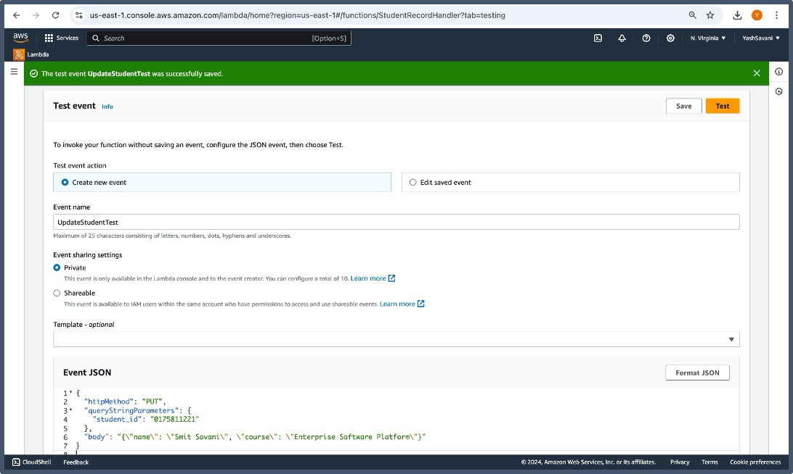

# CMPE272: Enterprise Software Platforms
## Assignment 2: Building a Serverless Web Application with AWS Lambda and DynamoDB
## Author: Yash Bharatbhai Savani
## SJSU ID: 017581122
## Guidance by: Prof. Rakesh Ranjan
## Objective:
In this assignment, you will create a simple serverless web application using AWS Lambda and Amazon DynamoDB as the database service. The goal is to understand how to: 

- Trigger a Lambda function using an API Gateway.
- Interact with DynamoDB to perform basic CRUD operations (Create, Read, Update, Delete).
- Deploy and test the application in the AWS environment.

## Steps:

### 1. Setting Up the DynamoDB Table

- Go to the AWS Management Console and navigate to DynamoDB.
- Create a new table:
  - Table Name: StudentRecords
  - Primary Key: student_id (String)
- After the table is created, note down the table name.

### 2. Creating an AWS Lambda Function

- Navigate to AWS Lambda in the AWS Management Console.
- Create a new Lambda function:
  - Function Name: StudentRecordHandler
  - Runtime: Choose Python 3.x or Node.js (depending on your preferred language).
  - Permissions: Attach the appropriate role to allow Lambda to read/write to DynamoDB.

- Inside your Lambda function, write code to handle basic CRUD operations with DynamoDB.
  - Create: Insert a new student record into the DynamoDB table.
  - Read: Fetch a student record by student_id.
  - Update: Update a student's details.
  - Delete: Remove a student record.
 
#### Python code for CRUD (Create, Read, Update, Delete) is given below.

### 3. Creating an API Gateway

- Go to API Gateway in the AWS Management Console.
- Create a new REST API:
  - API Name: StudentAPI
- Set up the following resources and methods:
  - POST /students: Trigger the Lambda function to add a new student.
  - GET /students: Trigger the Lambda function to retrieve student details by student_id.
  - UPDATE/students: Trigger the Lamda function to update student details by student_id.
  - DELETE/students: Trigger the Lamda function to delete student details by student_id.
- Deploy the API and note down the Invoke URL.

#### Invoke URL: https://tk7rx15gyg.execute-api.us-east-1.amazonaws.com/prod 

### 4. Testing the Application

- Use Postman or curl to test the API by sending HTTP requests to the deployed API Gateway.
- Test the following operations:
  - Create: Add a new student record.
  - Read: Retrieve the student record using the student_id.
  - Update: Update the student record using the student_id.
  - Delete: Delete the student record using the student_id.
 
#### POST Method:

#### GET Method:

#### UPDATE Method:

#### DELETE Method:

## Challenges Faced:

**1.	Permission Issues:** 
Setting up the appropriate IAM permissions for the Lambda function to access DynamoDB was one of the earliest problems. AccessDeniedException problems were caused by improperly configured permissions, underscoring how crucial it is to comprehend AWS Identity and Access Management (IAM) policies.

**2.	Event Structure Mismatches:** 
Errors relating to unexpected event structures, including missing httpMethod keys, were frequently encountered when testing the Lambda function. This necessitated close debugging and knowledge of the event object format used by API Gateway to activate Lambda functions.

**3.	Error Handling and Debugging:** 
It was difficult to debug faults in a serverless setup as AWS CloudWatch logs were the only source of information. This increased intricacy in comparison to conventional debugging tools seen in regional development environments.

## What I Learned:

**1.	Serverless Architecture Fundamentals:** 
I acquired practical knowledge of the fundamentals of serverless computing, such as how AWS Lambda features behave as event-driven services and how well they interface with other AWS services, such as DynamoDB.

**2.	Working with API Gateway:** 
I gained knowledge about how API Gateway acts as an interface for RESTful APIs that enable serverless functionality. My understanding of endpoint configuration, CORS management, and API deployment has improved as a result of this experience.

**3.	Understanding IAM Roles and Policies:** 
Configuring permissions between AWS services deepened my understanding of IAM roles and policies, which are critical for maintaining the security and functionality of cloud applications.

**4.	Implementing CRUD Operations in the Cloud:** 
Performing fundamental CRUD operations with DynamoDB provide insight into AWS NoSQL database management, highlighting the distinctions between cloud-native databases and conventional relational databases.

**5.	Troubleshooting in the Cloud:** 
I discovered the value of using CloudWatch to monitor and debug serverless apps, which gave me a practical understanding of how to maintain and troubleshoot cloud apps in production.

#### Overall, through this project, I gained hands-on experience in developing and implementing a cloud-native application, showcasing the possibilities of serverless architectures and emphasizing the value of careful configuration and testing in cloud environments.

